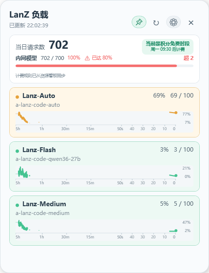
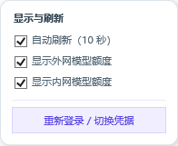

# LanZ Monitor

一个适用于 Windows 的轻量悬浮监控组件。它展示模型负载、当日请求数、内外网模型额度、剩余额度和当前积分计费状态。





## 功能

- 默认每 10 秒自动刷新（可暂停或手动刷新）；初始设置仅显示内网模型额度，外网模型额度可从齿轮菜单按需开启。
- 显示当日请求数，以及内网、外网模型额度的使用百分比和余量。
- 从资源看板动态解析积分免费/计费规则，显示当前状态与下一次切换时间。
- 默认使用按时间分段的状态柱状图，也可在齿轮菜单切换为自适应纵轴折线图；两种模式都保留最近 5 小时的本地采样。
- 轻量 JSONL 日志跨天保留 30 天负载状态，重启后先恢复上次画面，再更新实时数据。
- 绿、橙、红三档负载底色。
- 模型卡片可拖动排序，并在本机保存顺序。
- 大头钉可开启或取消窗口置顶。
- 自动刷新、图表模式、重新登录及两类额度的显示开关集中在右上角齿轮菜单。
- 会话失效时通过 WebView2 打开资源看板并自动接收新 Cookie。
- 连接配置和会话值使用 Windows DPAPI 加密，仅当前 Windows 用户可解密。

## 系统要求

- Windows 10 或 Windows 11
- PowerShell 7 或 Windows PowerShell 5.1
- Microsoft Edge WebView2 Runtime
- 一个与本项目数据结构兼容的模型状态 API

## 首次使用

### Windows EXE 版

1. 从 GitHub Releases 下载 `LanZ-Monitor.exe`。
2. 首次使用且本机还没有连接配置时，从仓库下载 `Set-LanZSession.ps1` 和 `setup-session.cmd`，在脚本同目录双击 `setup-session.cmd` 完成一次性配置。
3. 运行 `LanZ-Monitor.exe`。之后可从齿轮菜单选择“重新登录”，无需重新输入连接参数。

EXE 版运行监控器不需要另外安装 PowerShell 7；首次配置脚本使用 Windows 10/11 自带的 Windows PowerShell 5.1。GitHub Release 只附加 `LanZ-Monitor.exe`，不再发布容易造成误解的 `LanZ-Setup.exe`、压缩包或文档附件；配置脚本仍保留在仓库中作为一次性配置入口。交互式身份验证只负责在资源看板中登录并更新会话 Cookie，不能替代未知的 API 地址、字段和加密参数配置。WebView2 SDK 依赖会由主程序自动释放到 `%LOCALAPPDATA%\LanZ-Monitor\runtime\WebView2`。发布文件不包含服务地址、Cookie、Token、密钥或密码；这些内容只会在首次配置时写入当前用户的 DPAPI 加密文件。

GitHub 发布的 EXE 目前未使用商业代码签名证书签名，Windows 可能在首次启动时显示 SmartScreen 提示。可对照 Release 页面的 SHA-256 校验值确认文件完整性。

### 源码版

1. 下载或克隆仓库。
2. 双击 `setup-session.cmd`。
3. 根据提示填写模型状态 API、当日请求用量 API、资源看板页面、网页登录地址、Cookie 名称、请求令牌参数和接口状态代码。
4. 输入当前会话值。敏感输入不会显示在终端中。
5. 双击 `start-widget.cmd`。

所有运行数据都位于 `%LOCALAPPDATA%\LanZ-Monitor`，不再与程序代码混放。配置与会话值分别保存在 `secrets\connection.bin` 和 `secrets\session.bin`，二者均经过当前 Windows 用户范围的 DPAPI 加密。旧版本的 `.lanz-*` 数据会在首次启动时自动迁移。需要修改连接参数时可执行：

```powershell
powershell -NoProfile -ExecutionPolicy Bypass -File .\Set-LanZSession.ps1 -Reconfigure
```

也可以临时设置环境变量 `LANZ_SESSION_VALUE` 来覆盖本地加密会话值。

## 界面说明

- 当前负载是模型卡片右上角的百分比。
- “当日请求数”卡片显示内外网模型的已用额度、上限、百分比和余量；达到 80% 后变为红色提醒。
- 积分时段由程序从资源看板的当前页面脚本解析，每 30 分钟检查更新；如果短暂无法读取，会沿用最近一次成功规则。该规则只代表积分是否扣减，不代表请求次数不计入日额度。
- 图表右侧顶部和底部的数字是当前纵轴上限与下限，并非当前负载。
- 横轴采用非线性时间刻度：左侧约三分之一为 `5h → 1h → 30m → 15m`，右侧约三分之二放大 `15m → 10m → 5m → 2m → 1m → 50 → 40 → 30 → 20 → 10 → 0s`。采样按真实时间戳定位，缺失区间使用淡灰色占位。
- 柱状图中每根柱子代表一个时间采样段，颜色表示负载档位；折线图模式显示连续采样，超过 30 秒的数据缺口会断开。
- 负载低于 60% 显示绿色，60%–84% 显示橙色，85% 及以上显示红色。
- 按住模型卡片上下拖动可改变顺序。
- 右上角大头钉亮起时窗口保持置顶。
- 齿轮菜单中的显示选择和自动刷新状态会保存在本机 `settings\ui.json`。
- `data\chart-history.json` 只保存最近 5 小时；写盘时按图表像素宽度做时间桶降采样（每个模型最多约 83 段），使用紧凑 JSON，不会无限累积原始 10 秒点。
- `data\latest-status.json` 每 10 秒更新，用于重启后立即恢复最后画面。
- `data\load-history.jsonl` 每分钟归档一条，跨天保留 30 天，最多 50,000 条，防止日志无限增长。

## 安全设计

- 仓库不包含服务地址、Cookie 名称、请求签名密钥、会话值或账号密码。
- 程序不会读取网页登录密码，只读取配置指定域名在登录完成后设置的会话 Cookie。
- WebView2 使用独立的持久化用户数据目录，不直接读取桌面版 Edge 的密码库；程序不会把密码写入代码或配置。
- 登录窗口会打开资源看板并启用 WebView2 的自动填充/密码保存能力，但是否出现保存密码提示仍由站点策略和用户确认决定。程序只读取登录完成后指定域名的会话 Cookie。
- 凭据、动态规则缓存、界面偏好、负载历史和状态日志均位于用户的 `%LOCALAPPDATA%` 目录，不会进入 Git 仓库。

## 数据格式

当前解析逻辑期望 API 返回对象包含：

- `code`：接口状态代码
- `data[].modelName`：展示名称
- `data[].apiInterface`：模型 ID
- `data[].routeStatus.total_active`：当前并发量
- `data[].routeStatus.effective_max_concurrent`：有效容量
- `data[].routeStatus.available`：可用状态

当日用量 API 的 `data.overview` 需要包含：

- `dailyRequestCount`：当日请求数
- `externalDailyUsed` / `externalDailyLimit`：外网模型已用量与上限
- `internalDailyUsed` / `internalDailyLimit`：内网模型已用量与上限

负载计算方式为：

```text
floor(total_active / effective_max_concurrent * 100)
```

最高显示为 100%。

## 第三方组件

登录窗口使用 Microsoft WebView2 SDK。相关文件位于 `lib/WebView2`，组件许可见 `lib/WebView2/LICENSE.txt`。

## License

[MIT](LICENSE)
