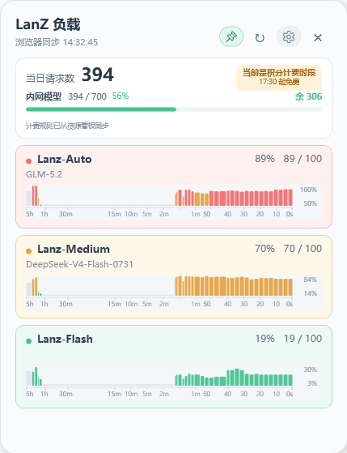

# LanZ Monitor

一个适用于 Windows 的轻量悬浮监控组件。它展示模型负载、当日请求数、内外网模型额度、剩余额度和当前积分计费状态。




## 功能

- 自动刷新使用持久 WebView2：先从资源看板取得额度，再自动打开主界面的“模型 API Key 申请”弹窗，被动解析该弹窗约每 3 秒产生的模型状态响应。程序不自行轮询模型接口；连续 15 秒没有模型包时只重载真实页面并重新打开弹窗。
- 手动刷新执行一次完整刷新：重新进入资源看板取得最新当日请求数和额度、刷新模型负载，并强制重新同步计费规则后立即重算当前免费/计费状态；即使自动刷新已暂停也可单次执行。
- 显示当日请求数，以及内网、外网模型额度的使用百分比和余量。
- 从资源看板动态解析积分免费/计费规则，显示当前状态与下一次切换时间。
- 默认使用按时间分段的状态柱状图，也可在齿轮菜单切换为自适应纵轴折线图；两种模式都保留最近 5 小时的本地采样。
- 首次使用按 Auto、Medium、Flash 排列；拖动后的个人顺序会保留，服务以后新增或下线模型时会自动兼容。
- 模型卡片会读取网页提供的实际模型说明；网页未提供或结构暂时无法解析时保持空白，不影响负载采集。
- 轻量 JSONL 日志跨天保留 30 天负载状态，重启后先恢复上次画面，再更新实时数据。
- 绿、橙、红三档负载底色。
- 模型卡片可拖动排序，并在本机保存顺序。
- 大头钉可开启或取消窗口置顶。
- 启动后驻留 Windows 系统托盘且不占用任务栏；关闭按钮只隐藏窗口，双击托盘图标显示/隐藏，右键菜单只保留“窗口置顶”和“退出”。重复启动会提示已有托盘实例并安全退出，不会再次初始化 WebView2。
- 自动刷新、图表模式、重新登录及两类额度的显示开关集中在右上角齿轮菜单。
- 首次运行直接打开 LanZ 登录页面；登录成功后自动取得并加密保存会话 Cookie，不需要填写 API、Cookie 名称、AES 参数或运行额外 Setup。
- 齿轮菜单可手动检查 GitHub 标记为 Latest 的正式 Release；程序读取固定地址的 `latest.txt`，不调用受共享 IP 限额影响的 REST API。发现更高版本后直接下载，文件大小、版本与 SHA-256 全部一致后再询问是否安装。
- 会话失效时通过 WebView2 打开资源看板并自动接收新 Cookie。
- 登录会话使用 Windows DPAPI 加密，仅当前 Windows 用户可解密。

## 系统要求

- Windows 10 或 Windows 11
- PowerShell 7 或 Windows PowerShell 5.1
- Microsoft Edge WebView2 Runtime
- 可访问 LanZ 资源管理页面的账号

## 首次使用

### Windows EXE 版

1. 从 GitHub Releases 下载带版本号的单文件 EXE，例如 `LanZ-Monitor-v1.4.2.exe`。
2. 运行 EXE。首次运行会直接打开 LanZ 登录页面；完成登录后，程序自动取得会话并开始监控。
3. 以后可直接运行同一个 EXE。重新登录、切换凭据和检查更新都位于齿轮菜单。

EXE 版不需要另外安装 PowerShell 7。GitHub Release 附加一个带版本号的 EXE 和一个很小的 `latest.txt` 更新清单，不发布 Setup、压缩包或文档附件。WebView2 SDK 依赖会由主程序自动释放到 `%LOCALAPPDATA%\LanZ-Monitor\runtime\WebView2`。程序内置 LanZ 的公开页面地址、响应路径与 Cookie 名称，不包含账号密码、有效会话值或请求签名密钥；登录后得到的会话只会写入当前用户的 DPAPI 加密文件。

GitHub 发布的 EXE 目前未使用商业代码签名证书签名，Windows 可能在首次启动时显示 SmartScreen 提示。可对照 Release 页面的 SHA-256 校验值确认文件完整性。

### 源码版

1. 下载或克隆仓库。
2. 双击 `start-widget.cmd`。
3. 首次运行会直接打开 LanZ 登录页面，完成验证即可。

所有运行数据都位于 `%LOCALAPPDATA%\LanZ-Monitor`，不再与程序代码混放。会话值保存在 `secrets\session.bin`，并经过当前 Windows 用户范围的 DPAPI 加密。旧版 `connection.bin` 可以继续留在本地，但新版本不会读取它；也可以临时设置环境变量 `LANZ_SESSION_VALUE` 覆盖本地加密会话值。

## 界面说明

- 当前负载是模型卡片右上角的百分比。
- “当日请求数”卡片显示内外网模型的已用额度、上限、百分比和余量；达到 80% 后变为红色提醒。
- 积分时段规则从资源看板脚本解析，规则页最多四小时低频校验一次；当前免费/计费状态则在每个约 3 秒界面节拍中使用缓存规则和本地时间重新判断，不产生额外网络流量。如果短暂无法读取规则，会沿用最近一次成功结果。该规则只代表积分是否扣减，不代表请求次数不计入日额度。
- 图表右侧顶部和底部的数字是当前纵轴上限与下限，并非当前负载。
- 横轴采用非线性时间刻度：左侧约三分之一为 `5h → 1h → 30m → 15m`，右侧约三分之二放大 `15m → 10m → 5m → 2m → 1m → 50 → 40 → 30 → 20 → 10 → 0s`。采样按真实时间戳定位，缺失区间使用淡灰色占位。
- 柱状图中每根柱子代表一个时间采样段，颜色表示负载档位；折线图模式显示连续采样，超过 30 秒的数据缺口会断开。
- 负载低于 60% 显示绿色，60%–84% 显示橙色，85% 及以上显示红色。
- 按住模型卡片上下拖动可改变顺序。
- 右上角大头钉亮起时窗口保持置顶。
- 齿轮菜单中的显示选择和自动刷新状态会保存在本机 `settings\ui.json`。
- “检查更新”不会后台轮询或发送遥测。它只读取 `https://github.com/HankLiu2020/LanZ-Monitor/releases/latest/download/latest.txt`；清单缺失、格式错误或校验不一致时会停止自动更新。
- `data\chart-history.json` 只保存最近 5 小时；写盘时按图表像素宽度做时间桶降采样（每个模型最多约 83 段），使用紧凑 JSON，不会无限累积原始采样点。
- `data\latest-status.json` 在每次成功的自动或手动刷新后覆盖更新，用于重启后立即恢复最后画面。
- `data\load-history.jsonl` 每分钟归档一条，跨天保留 30 天，最多 50,000 条，防止日志无限增长。

## 安全设计

- 仓库包含 LanZ 专用的公开服务地址、响应路径和 Cookie 名称，不包含请求签名密钥、有效会话值或账号密码。
- 程序不会读取网页登录密码，只读取内置 LanZ 域名在登录完成后设置的会话 Cookie。
- WebView2 使用独立的持久化用户数据目录，不直接读取桌面版 Edge 的密码库；程序不会把密码写入代码或配置。
- 登录窗口会打开资源看板并启用 WebView2 的自动填充/密码保存能力，但是否出现保存密码提示仍由站点策略和用户确认决定。程序只读取登录完成后指定域名的会话 Cookie。
- 模型负载和当日额度来自真实 WebView2 页面流量，由 WebView2 Runtime 自己生成浏览器 UA、Cookie 与请求上下文；程序不为这两类状态构造直接 API 请求。计费规则的低频看板读取不手工设置 `User-Agent`，也不伪造 `Sec-Fetch` 或 Client Hints。
- 凭据、动态规则缓存、界面偏好、负载历史和状态日志均位于用户的 `%LOCALAPPDATA%` 目录，不会进入 Git 仓库。
- GitHub 更新链路与内部服务客户端隔离，保持系统证书验证和证书吊销检查；下载文件必须通过固定仓库、固定附件名、大小及 SHA-256 校验。

更完整的威胁边界、残余风险和验证记录见 [`SECURITY_REVIEW.md`](SECURITY_REVIEW.md)。

## 数据格式

当前解析逻辑期望 API 返回对象包含：

- `code`：接口状态代码
- `data[].modelName`：展示名称
- `data[].apiInterface`：模型 ID
- `data[].routeStatus.total_active`：当前并发量
- `data[].routeStatus.effective_max_concurrent`：有效容量
- `data[].routeStatus.available`：可用状态

资源看板自身的当日用量响应中，`data.overview` 需要包含：

- `dailyRequestCount`：当日请求数
- `externalDailyUsed` / `externalDailyLimit`：外网模型已用量与上限
- `internalDailyUsed` / `internalDailyLimit`：内网模型已用量与上限

负载计算方式为：

```text
floor(total_active / effective_max_concurrent * 100)
```

最高显示为 100%。

## 第三方组件

登录窗口使用 Microsoft WebView2 SDK。相关文件位于 `lib/WebView2`，组件许可见 `lib/WebView2/LICENSE.txt`。

## License

[MIT](LICENSE)
